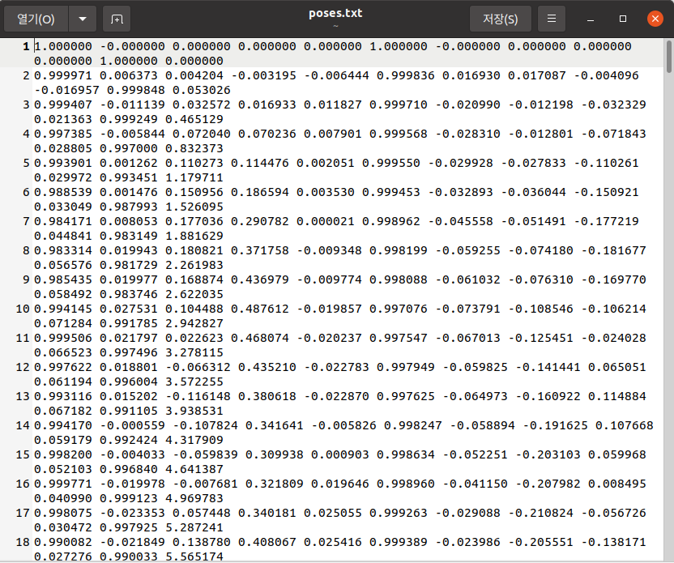

# LeGO-LOAM
### 내용
- LeGO-LOAM을 사용하여 pose 추출
- 추출한 pose를 poses.txt로 저장

### 참조
- [LeGO-LOAM](https://github.com/RobustFieldAutonomyLab/LeGO-LOAM.git)

### 사전 준비
- Ubuntu 20.04 LTS
- ROS1 Noetic
- catkin_package
- GTSAM
#### 수정
- /usr/include/pcl-1.10/pcl/filters/voxel_grid.h
``` bash
# pcl 라이브러리 수정
sudo gedit /usr/include/pcl-1.10/pcl/filters/voxel_grid.h

# 340번, 669번째 줄 변경
## 변경 전
for (Eigen::Index ni = 0; ni < relative_coordinates.cols (); ni++)
## 변경 후
for (int ni = 0; ni < relative_coordinates.cols (); ni++)
```

### build
``` bash
mkdir -p ~/catkin_ws/src
cd ~/catkin_ws/src
git clone https://github.com/t0mark/LiDAR_Labeling -b save_pose
cd ..
catkin_make
source ~/catkin_ws/devel/setup.bash
```

### 실행
``` bash
# 각각 다른 터미널에서 실행
## 각 터미널 마다 환경변수 설정
source ~/catkin_ws/devel/setup.bash
## 또는 영구 설정
echo "source ~/catkin_ws/devel/setup.bash" >> ~/.bashrc
source ~/.bashrc

# LeGO-LOAM 실행
roslaunch lego_loam run.launch

# pose-saver 실행
rosrun lego_loam_pose_saver pose_saver

# bag 파일 play
rosbag play {bag 파일} --clock /ouster/points:=/velodyne_points /ouster/imu:=/imu/data
```

### 결과
- pose-saver를 실행한 경로에 poses.txt 생성
- poses.txt 내용  
    

### 피드백
- LiDAR의 scan과 pose의 개수가 다름
- LeGO-LOAM이 Point Cloud를 다운 샘플링하여 사용하기 때문
- [SuMa](https://github.com/jbehley/SuMa) 사용

### <span style="background-color:#fff5b1"><span style="color:green"> TODO </span></span>
- LeGO-LOAM의 Point Cloud 다운 샘플링 코드 수정
- 또는, 다운 샘플링된 Point Cloud로 생성된 pose에 보간법을 적용하여 1:1 대응 되도록 수정

